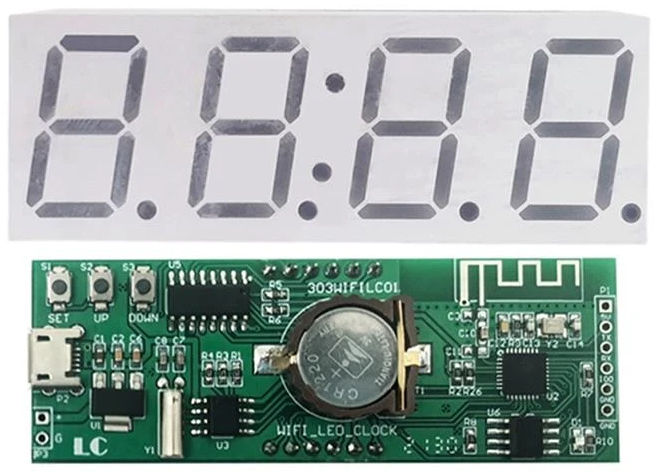
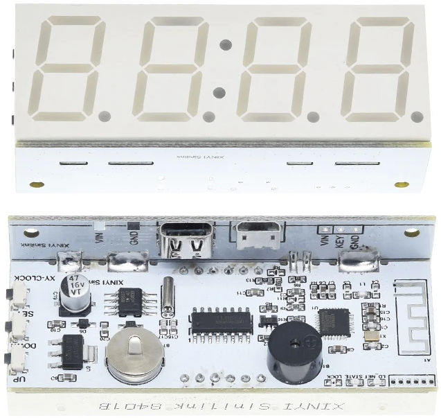

# ESPHome Alarm Clock 

This repository contains a number of configuration files for esphome & ESP8266 clock-based devices. 
The time can be synchronized from Home Assistant, or directly from a NTP server. The alarm can be configured from Home Assistant.

## 303wifilc01 

This module contains four 7-segment displays and a RTC module. The RTC module isn't used. 
The driver source code is based on work by [maarten-pennings](https://github.com/maarten-pennings/303WIFILC01)

Flashing instructions can be found within [maarten-pennings](https://github.com/maarten-pennings/303WIFILC01/tree/main/3-flash) github repo.

## xy-clock 

This module contains four 7-segment displays, a buzzer and a RTC module. The RTC module isn't used, but the buzzer can be configured as an alarm through Home Assistant. 
The driver source code is based on work by [Utyff](https://github.com/Utyff/xy-clock)

Flashing instructions can be found on [blakadder.com](https://templates.blakadder.com/XY-Clock.html)

## wemos d1 mini

A homemade alarm clock using a Wemos D1 mini, a buzzer and a TM1650 7-segment module.

